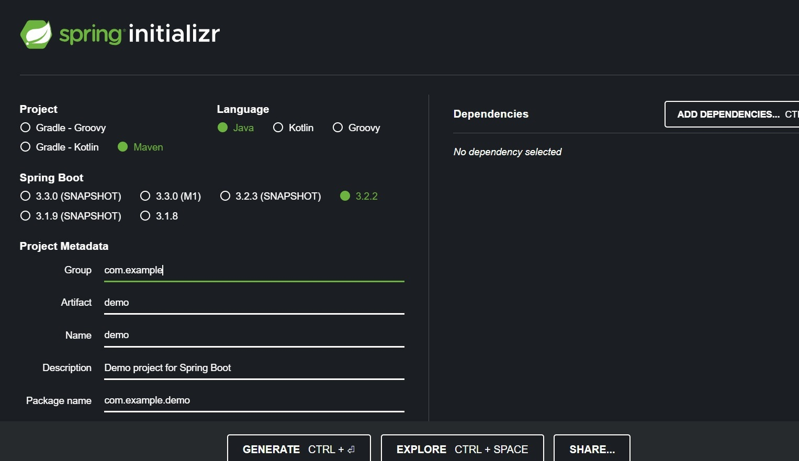

# Calculator
<h2 align = 'center'>Онлайн калькулятор на микросервисной архитектуре</h2>

Данный проект написан на языке Java, фреймворк Spring. Ниже будут показаны постепенные шаги создания

1)Установил и настроил среду разработки:

2)Собрал проект на сайте start.spring.io:

3)Извлек из данной папки все в созданный мною проект:

4)В папке "practice" создал папку "controller":

5)Создал файл CalcController.java и написал в нем два метода для моего калькулятора, а также создал аннотации к ним:

6)Отладка без ошибок:

7)Перехожу на localhost и передаю в запрос метод, которым хочу воспользоваться и 2 аргумента, соответсвенно получаю результат:

8)Подключаю веб-интерфейс для моей программы при помощи Swagger, для этого  в xml файле пишу нужные зависимости:

9)Дабы проверить интерфейс , ввожу новую ссылку в браузере - http://localhost:8080/swagger-ui/index.html. Результат:

